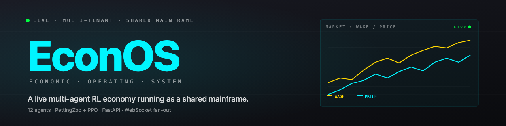
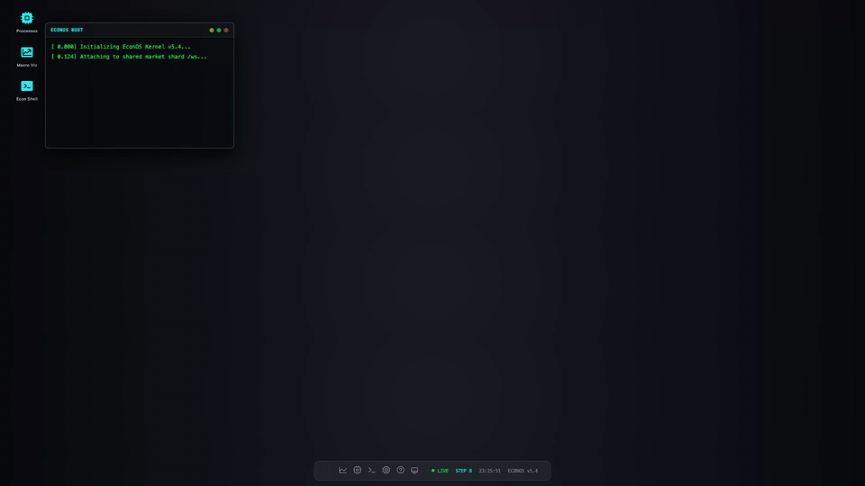
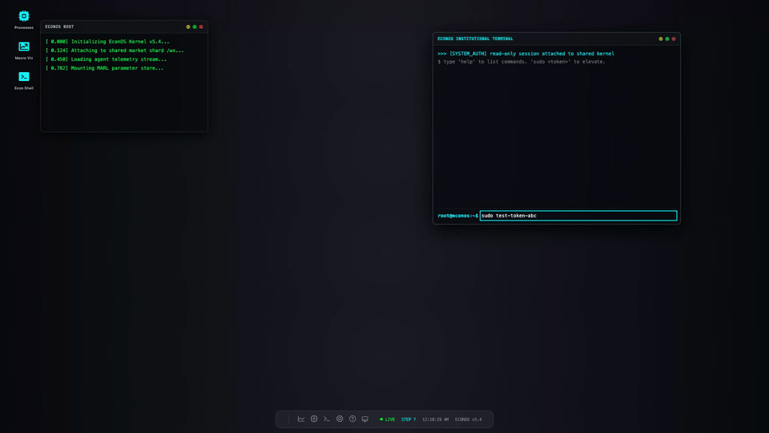
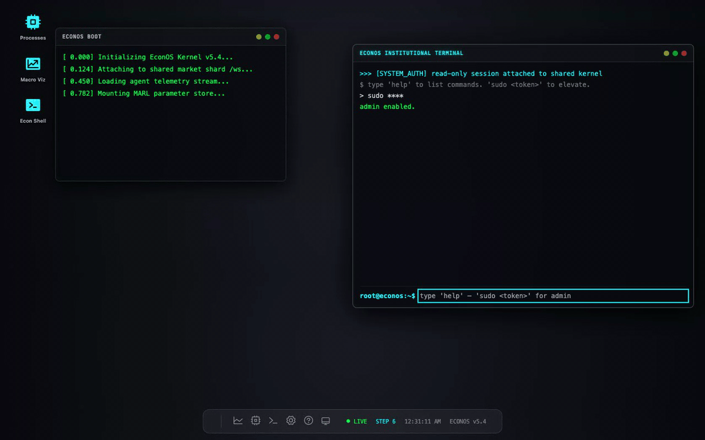
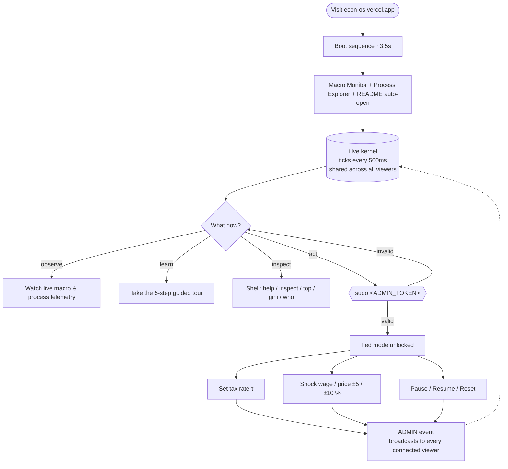
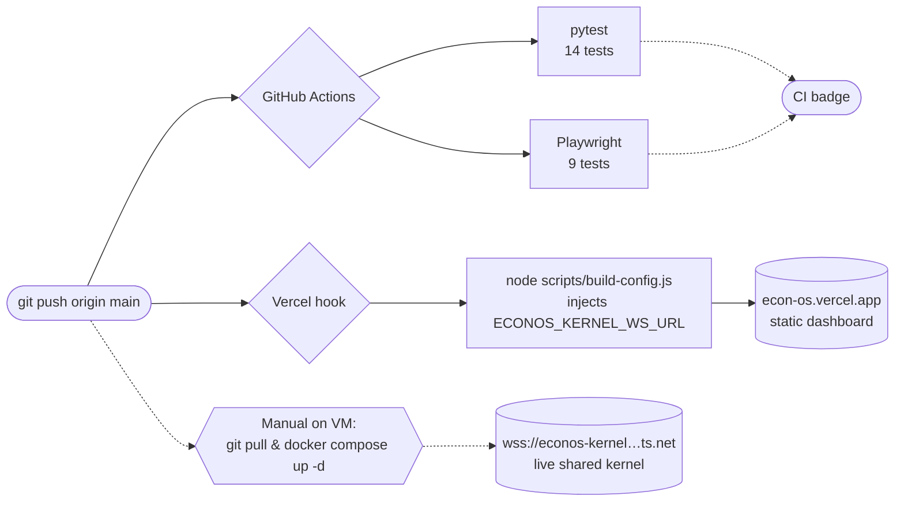

<p align="center">
  <picture>
    <source media="(prefers-color-scheme: dark)" srcset="docs/banner.png">
    <source media="(prefers-color-scheme: light)" srcset="docs/banner-light.png">
    
  </picture>
</p>

# EconOS | Economic Operating System

[](https://github.com/Builder106/EconOS/actions/workflows/ci.yml)
[](https://www.python.org/)
[](LICENSE)
[](https://github.com/Builder106/EconOS/actions/workflows/ci.yml)
[](https://pettingzoo.farama.org/)
[](https://fastapi.tiangolo.com/)
[](https://econ-os.vercel.app)

> **A high-fidelity Multi-Agent Reinforcement Learning (MARL) desktop environment for decentralized economic simulation.**

EconOS is a sophisticated "Operating System" for market simulations. It treats economic agents as system processes, providing a unique, glassmorphic desktop interface to monitor and interact with emergent market behaviors. Using state-of-the-art RL (PPO), agents discover optimal pricing, wage-setting, and consumption strategies within a closed-loop economy.

**Live demo:** [econ-os.vercel.app](https://econ-os.vercel.app) — multi-tenant, shared mainframe. Every visitor sees the same simulation in real time. Dashboard ships with **dark + light themes** (cycles via the taskbar moon icon, defaults to your OS preference) — and the demo GIFs below auto-match your browser theme via `<picture>` + `prefers-color-scheme`.

<picture>
  <source media="(prefers-color-scheme: dark)" srcset="docs/media/01-boot-and-live-dark.gif">
  <source media="(prefers-color-scheme: light)" srcset="docs/media/01-boot-and-live-light.gif">
  
</picture>

<details>
<summary><b>Fed mode — admin tax propagates from shell to Policy Manager</b></summary>

After `sudo <token>` elevates the connection, `tax 25` in the shell mutates the running kernel and the Policy Manager UI snaps to 25.00% on the next tick.

<picture>
  <source media="(prefers-color-scheme: dark)" srcset="docs/media/02-admin-tax-propagation-dark.gif">
  <source media="(prefers-color-scheme: light)" srcset="docs/media/02-admin-tax-propagation-light.gif">
  
</picture>

</details>

<details>
<summary><b>Broadcast events — admin shocks visible to every viewer</b></summary>

`shock wage 10` issued by one admin's shell broadcasts as a `* [ADMIN] shock_applied` event to every connected viewer's shell. The kernel applies the multiplicative shock on the next tick.

<picture>
  <source media="(prefers-color-scheme: dark)" srcset="docs/media/03-admin-shock-broadcast-dark.gif">
  <source media="(prefers-color-scheme: light)" srcset="docs/media/03-admin-shock-broadcast-light.gif">
  
</picture>

</details>

## User Flow

Every visitor lands in the same place — the shared kernel ticks regardless of who's watching. The interesting branch is `sudo`: once elevated, admin actions mutate the running kernel and **broadcast back to every connected viewer**, which is what the "shared mainframe" pitch actually means.



The dotted feedback edge is the single piece of magic — without it EconOS would be N independent simulations. With it, one admin's `tax 25` shows up on every other visitor's Macro Monitor inside one tick.

## Key Features

- **EconOS Desktop**: A custom, library-free window management system in vanilla JS.
- **MARL Core**: Built on [PettingZoo](https://pettingzoo.farama.org/) and [Stable-Baselines3](https://stable-baselines3.readthedocs.io/).
- **Economic Invariants**: Mathematically verified closed-loop economy (No money leakage).
- **Process Explorer**: Monitor agent "memory" (wealth) and "status" (RL policy state) in real-time.
- **Root Shell**: Interactive terminal for kernel commands and policy overrides.
- **Deep Macro Analytics**: Real-time Gini Index, Lorenz Curves, and CPI tracking.

## Architecture

- **`simulation/`**: Core Gym/PettingZoo environment and economic logic.
- **`dashboard/`**: Glassmorphic terminal interface (Tailwind + Chart.js).
- **`logic.py`**: Mathematical bedrock (Utility, Production functions).

## Getting Started

1. **Setup**:
   ```bash
   python3 -m venv .venv
   source .venv/bin/activate
   pip install -r requirements.txt
   ```

2. **Run Simulation**:
   ```bash
   python3 simulation/train.py
   ```

3. **View Dashboard**:
   Open `dashboard/index.html` in your browser.

## CI/CD Pipeline



| Stage | Trigger | What runs | Wall-clock (warm cache) | Where it shows up |
|---|---|---|---|---|
| **CI · pytest** | push to `main`, every PR | env + command-dispatch tests | ~30 s | [Actions tab](https://github.com/Builder106/EconOS/actions) + green badge |
| **CI · Playwright** | push to `main`, every PR | 3 smoke + 6 admin-flow e2e | ~2 min | same |
| **CD · Vercel (frontend)** | push to `main` | [`scripts/build-config.js`](scripts/build-config.js) writes `dashboard/config.js` from `ECONOS_KERNEL_WS_URL`; static `dashboard/` deploys | ~30 s | [econ-os.vercel.app](https://econ-os.vercel.app) |
| **CD · kernel VM (backend)** | **manual** | SSH in, `git pull && sudo docker compose -f deploy/docker-compose.yml up -d` | ~30 s if image is cached | `wss://econos-kernel.<tailnet>.ts.net` |

Config lives in [`.github/workflows/ci.yml`](.github/workflows/ci.yml) (CI), [`vercel.json`](vercel.json) (frontend CD), and [`deploy/docker-compose.yml`](deploy/docker-compose.yml) (backend, run manually).

**What's automatic.** Every push to `main` runs both test suites in parallel jobs (`concurrency: cancel-in-progress` cancels stale runs when commits land back-to-back). Vercel listens on the same push hook and rebuilds the dashboard with the latest committed code + the prod `ECONOS_KERNEL_WS_URL` env var — typically live ~60 seconds after `git push` returns. The CI job caches pip, npm, and the Playwright Chromium binary so cold-start vs. warm-cache is a 5×–10× swing.

**What's manual, and why.** The backend kernel on Oracle Always Free is updated by hand: `git pull && docker compose up -d` over SSH. Automating this would require committing an SSH private key as a GitHub Secret and adding a deploy job — small footprint, real attack surface for a portfolio repo. The kernel changes once every few PRs at most; manual SSH is fine until that frequency justifies the secret. See [CONTRIBUTING.md → What's open for contribution](CONTRIBUTING.md) — automating it is on the punch list when it pays for itself.

**On failure.** The Playwright job uploads `playwright-report/` + `test-results/` as a 7-day artifact. Download it, unzip, and `npx playwright show-report ./playwright-report` to replay traces and videos locally — usually points at the exact selector or WS frame that broke.

## Theory vs. Agentic Emergence

The simulation is built on formal economic objective functions, but the market dynamics are purely emergent from agent learning.

### Agent Objectives
- **Consumers**: Maximize Lifetime Utility $U$ subject to budget constraints:
  $$U = \sum_{t} \gamma^t (C_t^\alpha \cdot (1 - L_t)^{1-\alpha})$$
  *Where $C$ is consumption, $L$ is labor, and $\alpha$ (~0.7) is the consumption preference.*

- **Producers**: Maximize Profit $\Pi$ by optimizing production $Q$ vs. Wage costs $W$:
  $$\Pi = P \cdot A(L)^\beta - W \cdot L$$
  *Where $A$ is technology efficiency and $\beta$ is the returns to scale.*

### Key Observations
1. **Price Discovery**: Agents successfully find a stable price-wage ratio within 5,000 timesteps of PPO training.
2. **Shock Response**: When "God Mode" policy shifts are applied (e.g., higher taxes), agents dynamically adjust their labor supply to maintain utility levels, reflecting real-world labor elasticity.

---
